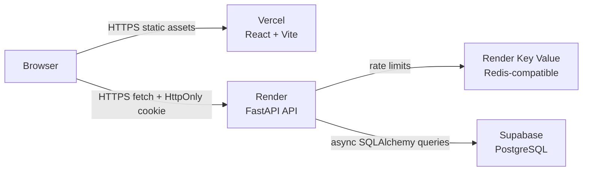
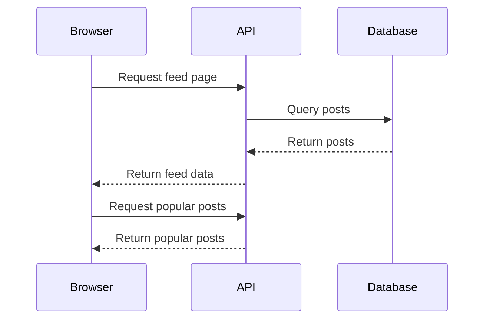
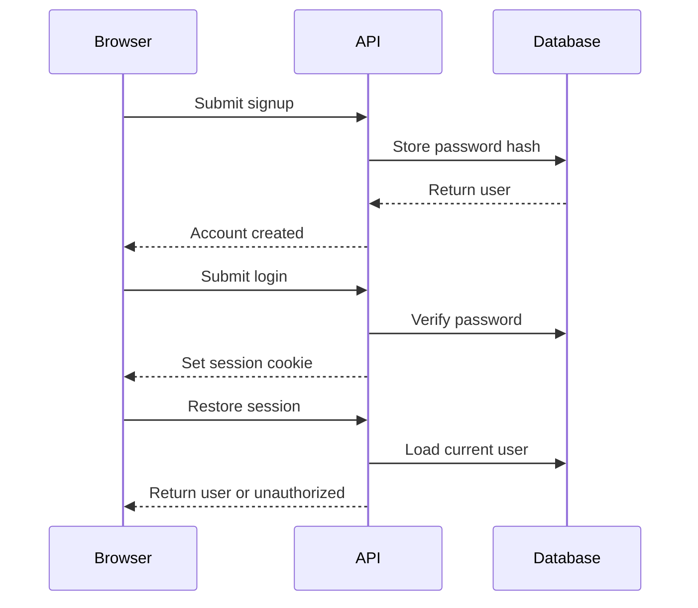
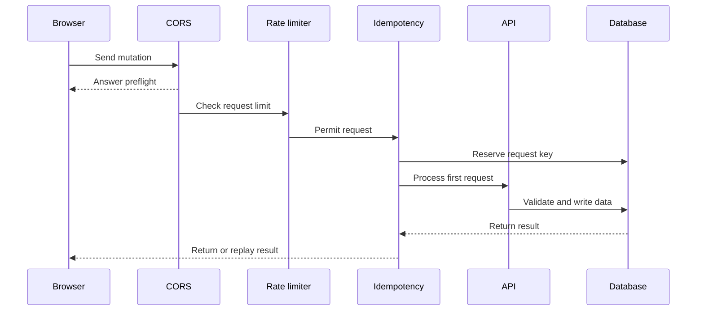

# Orbit

Orbit is a full-stack community feed for publishing posts, discussing them in comments, and expressing lightweight feedback through likes. It is intentionally built as a learning project with production-minded boundaries: a React/Vite browser client, a FastAPI API, Supabase-hosted PostgreSQL, and Redis-compatible infrastructure for request safety.

## What this repository demonstrates

- Cookie-based account sessions with short-lived JWTs and Argon2 password hashes.
- Public reads with authenticated mutations: posts, comments, likes, profiles, and passwords.
- Owner-only editing and deletion enforced by the API and reflected in the UI.
- Database-backed integrity, cursor pagination, cascade deletes, rate limiting, request idempotency, and bounded timeouts.
- A responsive React UI that remains usable down to a 375px-wide phone viewport.

This project is not a hosted authentication product. The FastAPI service owns its user/session logic and uses Supabase primarily as managed PostgreSQL. The server creates a Supabase client from server-only credentials for future server-side integration; the React application does not use a Supabase key directly.

## Architecture



| Component | Why it exists | Responsibilities |
| --- | --- | --- |
| React + Vite | Fast browser UI and simple static deployment | Rendering, forms, optimistic state, mobile layout, API diagnostics |
| FastAPI | Trusted application boundary | Validation, authentication, authorization, CORS, request handling, API responses |
| Supabase PostgreSQL | Managed relational persistence | Users, posts, comments, likes, idempotency records, foreign-key integrity |
| Render Key Value | Shared Redis-compatible store | Distributed token-bucket rate limiting for every API instance |
| Vercel | Frontend host/CDN | Builds and serves the Vite bundle; injects public build-time configuration |
| Render | Backend host | Runs Uvicorn, exposes health checks, and stores production environment variables |

## Repository map

```text
.
├── frontend/Orbit/          # React 19 + Vite UI
│   └── src/
│       ├── App.jsx          # Screens, local state, optimistic mutations
│       ├── App.css          # Component and responsive styles
│       └── api/client.js    # Fetch wrapper, timeout, idempotency keys
├── backend/
│   ├── main.py              # App startup, middleware, CORS, health endpoint
│   ├── auth.py              # JWT creation/validation and cookie settings
│   ├── routers/             # HTTP route definitions
│   ├── services/            # Database operations and ownership-scoped queries
│   ├── schemas/             # Pydantic request/response validation
│   ├── models/              # SQLAlchemy mappings
│   └── alembic/             # Versioned PostgreSQL migrations
├── render.yaml              # Render web-service blueprint
└── README.md
```

## Core request flows

### 1. Loading the public feed



Visitors can read posts and comments without signing in. `GET /api/auth/me` returning `401` during page load is expected for a guest; the UI treats it as “not signed in,” not as an application error.

Feed reads are cursor-paginated, not offset-paginated. The server requests one extra row, returns at most 20 items, and uses the last available ID as `next_cursor`. This is predictable and avoids the performance degradation of large offsets.

### 2. Signup, login, and session restoration



The JWT contains only the user email subject and expiration. It is held in an `HttpOnly` cookie, so JavaScript cannot read it. In production the cookie must be `Secure` and `SameSite=None` because the Vercel frontend and Render API are different origins.

### 3. A protected mutation



The React client automatically creates a UUID idempotency key for every `POST`, `PUT`, and `DELETE`. The API persists successful responses for 24 hours, so a browser retry cannot duplicate a mutation. Reusing a key with a different body returns `409`.

Redis is required for mutations. If it is unavailable, the service intentionally allows public reads but rejects writes with `503 rate_limiter_unavailable`. This fail-closed behavior prevents an outage from silently removing abuse protection.

### 4. Updating or deleting user content

Posts and comments are editable only by their author. The UI only renders edit/delete controls for records marked `is_owned_by_current_user`, but this is only a convenience. The API is the authority:

```text
UPDATE/DELETE target
WHERE target.id = requested_id
  AND target.author_email = authenticated_user.email
```

If no row matches, the API returns `404` for both a missing target and another user’s target. This avoids revealing whether an arbitrary ID exists. The database already defines `ON DELETE CASCADE` from posts to comments and from posts/comments to their like ledgers, so deleting a post removes its dependent conversation/like data in one safe relational operation.

## Security model

| Control | Why it is used |
| --- | --- |
| Argon2 via `pwdlib` | Passwords are slow-hashed; plaintext passwords are never stored. |
| HttpOnly JWT cookie | Reduces token exposure to XSS compared with local storage. |
| `Secure` + `SameSite=None` in production | Enables secure cross-origin Vercel-to-Render session cookies. |
| Exact CORS allowlist | Limits credentialed browser requests to approved frontend origins. |
| Pydantic schemas | Enforce types, length limits, email rules, password rules, and username format. |
| Plain-text validation | Rejects HTML markup and null bytes before post/comment content is stored. React also renders content as text, not HTML. |
| Ownership-scoped queries | Prevents IDOR: a valid session cannot edit or delete another account’s content. |
| Foreign keys and checks | Prevent orphaned records, duplicate likes, and negative cached counters. |
| Cascade deletes | Removes dependent comments/likes without foreign-key failures. |
| Redis token buckets | Limits authentication attempts and mutations across API instances. |
| Idempotency records | Makes network retries safe for mutations and avoids duplicate writes. |
| 9-second SQL / 10-second request limits | Bounds stalled database work and returns structured failure responses. |

Security controls reduce risk; they do not replace normal operational work. Keep secrets out of Git, rotate compromised credentials, restrict Render/Vercel access, review logs, and keep dependencies updated.

## Data model

| Entity | Key fields | Notes |
| --- | --- | --- |
| `users` | `email` primary key, password hash, optional public `username` | Email is the private authorization identity; username is the displayed author name. |
| `posts` | ID, title, content, owner label, `author_email`, likes count | `author_email` controls ownership even if a username later changes. |
| `comments` | ID, post ID, comment text, owner label, `author_email` | Belongs to a post and is removed when its post is deleted. |
| `post_likes` / `comment_likes` | Composite user/resource primary keys | Makes duplicate likes physically impossible. Database triggers maintain cached counts. |
| `idempotency_keys` | Scope, client key, request hash, completed response | Scopes a mutation key to the route/method/request principal and expires it after one day. |

Alembic migrations are the source of truth for database changes. Apply them in order; do not edit production tables manually without recording a migration.

## API reference

All API paths are prefixed with `/api`. Mutating requests require an `Idempotency-Key` header. The frontend client adds it automatically.

| Method | Path | Authentication | Purpose |
| --- | --- | --- | --- |
| `GET` | `/posts?limit=20&cursor=` | Optional | Cursor-paginated feed |
| `GET` | `/posts/popular` | Optional | Engagement-ranked posts |
| `GET` | `/posts/{post_id}` | Optional | One post |
| `POST` | `/posts` | Required | Create a post; requires a username |
| `PUT` | `/posts/{post_id}` | Owner only | Replace title/content/published state |
| `DELETE` | `/posts/{post_id}` | Owner only | Delete post and dependent records |
| `GET` | `/posts/{post_id}/comments` | Optional | Chronological comments |
| `POST` | `/posts/{post_id}/comments` | Required | Create a comment; requires a username |
| `PUT` | `/comments/{comment_id}` | Owner only | Replace comment text |
| `DELETE` | `/comments/{comment_id}` | Owner only | Delete a comment |
| `POST` / `DELETE` | `/posts/{post_id}/like` | Required | Like or unlike a post once |
| `POST` / `DELETE` | `/comments/{comment_id}/like` | Required | Like or unlike a comment once |
| `POST` | `/auth/signup` | Public | Create an account |
| `POST` | `/auth/login` | Public | Set a session cookie |
| `POST` | `/auth/logout` | Public | Clear any current session cookie |
| `GET` | `/auth/me` | Required session | Return current safe profile |
| `PATCH` | `/auth/me/profile` | Required session | Change public username |
| `PUT` | `/auth/me/password` | Required session | Change password after current-password verification |
| `POST` | `/users` | Public | Legacy account-registration route with the same validation model |
| `GET` | `/healthz` | Public | Lightweight Render health check |

Common response codes: `401` means no valid session, `404` may mean a missing or non-owned edit/delete target, `409` indicates a duplicate/conflict or in-progress idempotency request, `429` indicates rate limiting, `503` indicates unavailable Redis/database infrastructure, and `504` indicates a timeout.

## Frontend behavior

`frontend/Orbit/src/api/client.js` centralizes all requests. It:

- Reads the Vite build-time `VITE_API_URL` and ensures it has the `/api` prefix.
- Sends `credentials: "include"` so session cookies accompany API calls.
- Adds `Accept: application/json`, mutation content type, and idempotency headers.
- Aborts requests after 65 seconds and shows a server wake-up notice after four seconds.
- Converts non-JSON proxy errors into a safe user-facing message.
- Emits browser-console diagnostics for failures and optionally all API activity when `VITE_API_DEBUG=true`.

The React UI loads feed/popular/current-user state independently, uses optimistic rendering for new posts/comments/likes, reconciles successful API responses into local state, and rolls back failed optimistic work. Post/comment edit and delete controls are rendered only for server-confirmed owners. All mutation failures become toast notifications.

The UI uses fluid widths, a tablet one-column breakpoint, and a phone breakpoint. Inputs use 16px text on phones to avoid iOS auto-zoom, key controls have 44px minimum touch targets, and fixed notices are constrained to the mobile viewport.

## Local development

### Prerequisites

- Python 3 with a virtual environment
- Node.js and npm
- PostgreSQL, or a Supabase database connection
- Redis-compatible server for mutations

### 1. Backend environment

Copy `backend/.env.example` to `backend/.env` and provide local values. Do not commit this file.

```env
DB_NAME=Localorbit
DB_USER=postgres
DB_PASSWORD=replace-me
DB_HOST=localhost
DB_PORT=5432
JWT_SECRET=replace-with-a-long-random-secret
REDIS_URL=redis://localhost:6379/0
CORS_ORIGINS=http://localhost:5173
COOKIE_SECURE=false
COOKIE_SAMESITE=lax
```

`DATABASE_URL` takes precedence over the individual `DB_*` values. Use it for Supabase/PostgreSQL connection URIs. When connecting to Supabase, set `DB_SSL_MODE=require`; the application handles TLS and disables async prepared-statement caches for the transaction pooler on port `6543`.

### 2. Install and migrate

```powershell
python -m venv venv
.\venv\Scripts\Activate.ps1
python -m pip install -r backend\requirements.txt

cd backend
..\venv\Scripts\python.exe -m alembic -c alembic.ini upgrade head
```

### 3. Start Redis and the API

```powershell
docker run --name orbit-redis -p 6379:6379 redis:7-alpine

cd backend
..\venv\Scripts\python.exe -m uvicorn main:app --reload
```

The API is available at `http://127.0.0.1:8000`. OpenAPI is at `/docs`; the health endpoint is `/healthz`.

### 4. Start the frontend

Copy `frontend/Orbit/.env.example` to `frontend/Orbit/.env` and set the local API URL if necessary.

```powershell
cd frontend\Orbit
npm install
npm run dev
```

Open `http://localhost:5173`.

### Local quality checks

```powershell
python -m compileall -q backend
cd frontend\Orbit
npm run lint
npm run build
```

## Production deployment

The frontend is deployed to Vercel and the API to Render using `render.yaml`.

### Render API variables

| Variable | Required value/role |
| --- | --- |
| `ENVIRONMENT` | `production` |
| `DATABASE_URL` | Supabase PostgreSQL connection URI, never the Supabase REST URL |
| `DB_SSL_MODE` | `require` |
| `JWT_SECRET` | Long random secret, stored only in Render |
| `CORS_ORIGINS` | Exact frontend origin(s), comma-separated, no paths or trailing slashes |
| `COOKIE_SECURE` | `true` |
| `COOKIE_SAMESITE` | `none` |
| `REDIS_URL` | Render Key Value internal Redis-compatible URL |
| `SUPABASE_URL` / `SUPABASE_KEY` | Server-only values; never expose `SUPABASE_KEY` to Vercel |

Create Render Key Value in the same region as `orbit-api`, copy its **Internal URL**, assign it to `REDIS_URL`, and redeploy the API. Reads can function without Redis, but all mutations correctly fail closed until Redis is available.

### Vercel variable

| Variable | Value |
| --- | --- |
| `VITE_API_URL` | `https://orbit-1-47b5.onrender.com/api` |

Vite embeds `VITE_*` values at build time. Save the variable for Production and redeploy Vercel after changing it. Do not put database credentials, JWT secrets, Redis URLs, or `SUPABASE_KEY` into Vercel.

For the current production frontend, Render must allow:

```env
CORS_ORIGINS=https://orbit-mu-wine.vercel.app
```

If the site shows a Vercel login page instead of Orbit, disable Vercel Authentication/Deployment Protection for the intended production environment or use the appropriate approved sharing mechanism.

### Release checklist

- [ ] `main` is pushed and the Vercel build completed successfully.
- [ ] Render has all required production variables and has been redeployed.
- [ ] Render Key Value is available and `REDIS_URL` uses its internal URL.
- [ ] `https://orbit-1-47b5.onrender.com/healthz` returns `{"status":"ok"}`.
- [ ] The Vercel URL loads in an incognito window without Vercel authentication.
- [ ] Feed/popular reads succeed; guest `/auth/me` returns the expected `401`.
- [ ] Signup, login, refresh/session restoration, create/edit/delete post, create/edit/delete comment, and likes succeed.
- [ ] Browser console has no CORS failures; Render logs show preflight `200` and expected mutation responses.

## Troubleshooting

| Symptom | Likely cause | Fix |
| --- | --- | --- |
| `OPTIONS ... 400` or browser CORS error | Render allowlist does not match the exact Vercel origin | Set `CORS_ORIGINS` to the public origin without path/trailing slash; redeploy Render. |
| Vercel login wall | Deployment Protection is enabled | Change the project’s Deployment Protection setting or use an approved share link. |
| Frontend says API is missing | Vercel lacks a valid build-time API URL | Set `VITE_API_URL` and redeploy Vercel. |
| `Rate limiter unavailable` | Redis is absent/unreachable | Provision Render Key Value, use its same-region internal URL as `REDIS_URL`, redeploy. |
| Guest `/auth/me` is `401` | No session cookie exists | Expected behavior; sign in to create a session. |
| Login succeeds but session is not restored | Cookie/CORS production settings are wrong | Verify exact origin, `COOKIE_SECURE=true`, and `COOKIE_SAMESITE=none`. |
| `A valid Idempotency-Key header is required` | Custom mutation client bypassed the API helper | Send a unique `Idempotency-Key` for every `POST`, `PUT`, and `DELETE`. |
| `503 database_unavailable` or `504 database_timeout` | Database connectivity/pool/slow-query issue | Check Supabase connection URI, SSL settings, pool limits, and Render logs. |
| UI appears stale after changing env variables | Vite bundle was built with old values | Redeploy Vercel; `.env` changes on a local machine do not alter an existing deployment. |

## Development practices

- Keep `.env` files out of Git; root `.gitignore` already excludes them.
- Make schema/model/migration changes together and review generated migration SQL before production use.
- Use the frontend API client for all browser mutations so credentials, timeouts, diagnostics, and idempotency are consistent.
- Treat API-side authorization as mandatory even when the UI hides controls.
- Before release, run the quality checks and complete the release checklist above.

## Current limitations

- No automated test suite is currently included; compilation, linting, build checks, and manual release-flow verification are required.
- Threaded replies, file uploads, account recovery, moderation, and a custom domain are not implemented.
- The server-side Supabase client is provisioned for future features but is not currently the primary application access path.
